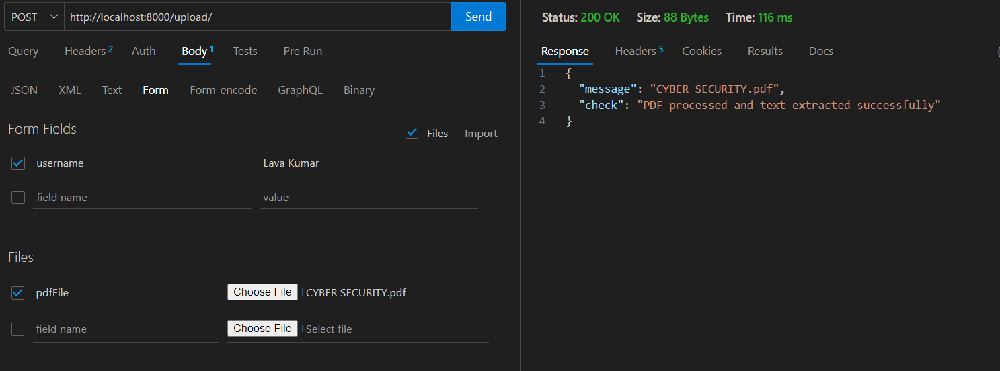
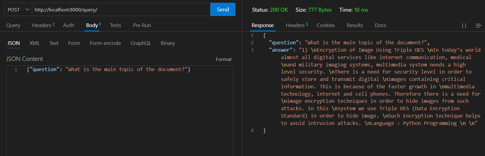
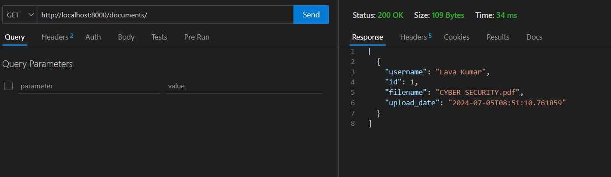

# Fullstack Internship Assignment

This project consists of a backend and a frontend to handle user-uploaded PDFs, extract their content, and answer user questions based on the content of the PDFs.


## Demo Video

<video width="320" height="240" controls>
  <source src="./Fullstack Internship Assignment Demo.mp4" type="video/mp4">
</video>

if not loading please find in https://drive.google.com/file/d/1E-Qnb7BVMBEGiERcU1fVoZGuIwCHlwUP/view?usp=sharing

## Prerequisites

- Python (for the backend)
- Node.js and npm (for the frontend)

## Installation

### Backend

1. Navigate to the project root directory.
2. Install the required Python packages(install in backend directory):
   ```bash
   pip install -r requirements.txt
   ```
3.start backend
```bash
  python ./backend/app.py
```
The backend runs at port 8000.

### Frontend
1.Change directory from the root to the frontend:
```bash
  cd frontend
```
2.Install the required Node.js packages:
```bash 
  npm install
```

Start the frontend server:
```bash 
  npm start
```

The frontend runs at port 3000.


### Frontend Features
1.When the user loads the frontend application, a prompt will appear to enter the username.

2.The user cannot ask a question unless they upload a PDF file.

3.Upon uploading a PDF file, the user can ask questions related to the content of the uploaded PDF.

## Backend API

### PDF Uplaod
```bash /upload/ 
Method : POST
Parameter : - pdfFile (File)
            - username (string)
```

Description: This route accepts a PDF file and a username. It saves the PDF and the username in a SQLite database with a timestamp and preprocesses the PDF to save the extracted text.

Request Body:- username: The username of the person uploading the PDF.
             - file: The PDF file to be uploaded.
             
Response:Success or error messages will be notified to the user.

1.The extracted text from the PDF is saved at backend/extracted_text/extracted_text.txt. 

2.User-uploaded PDFs are saved in the system under backend/uploads.




### Finds the answer
``` bash /query/
method :POST
paramters : - Question (string)
```
Description: This route takes a user's questionn and finds the answer based on the uploaded PDF.

Request Body:question: The question to be answered.

Response:The answer to the question based on the content of the uploaded PDF.

Success or error messages will be notified to the user.



### Gets all documents saved in sqllite database
``` bash /documents/
Method : Get
Parameters : none
```



### Notifications
Users will be notified of every success or error message during the interaction with the application.


